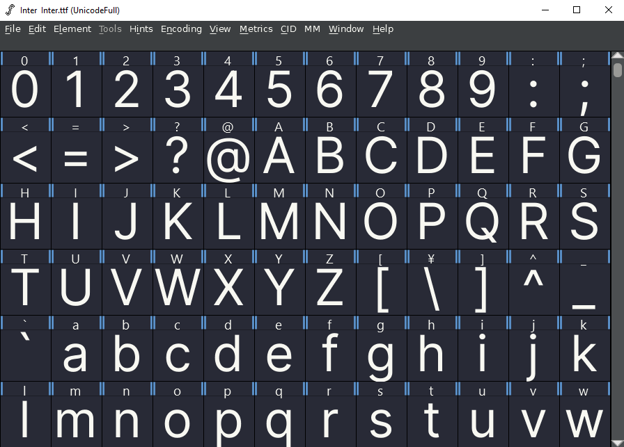

<!--
SPDX-FileCopyrightText: 2018 Dracula Theme
SPDX-FileCopyrightText: 2023 Javier Pérez

SPDX-License-Identifier: MIT
-->

# Dracula for [FontForge](https://fontforge.org)

> A dark theme for [FontForge](https://fontforge.org).

## Install

All instructions can be found at [draculatheme.com/fontforge](https://draculatheme.com/fontforge).

## Community

- [GitHub](https://github.com/dracula/dracula-theme/discussions) - Best for asking questions and discussing issues.
- [Discord](https://draculatheme.com/discord-invite) - Best for hanging out with the community.

## License

This repository is compliant with version 3 of the REUSE specification.

<https://reuse.software/spec/>
